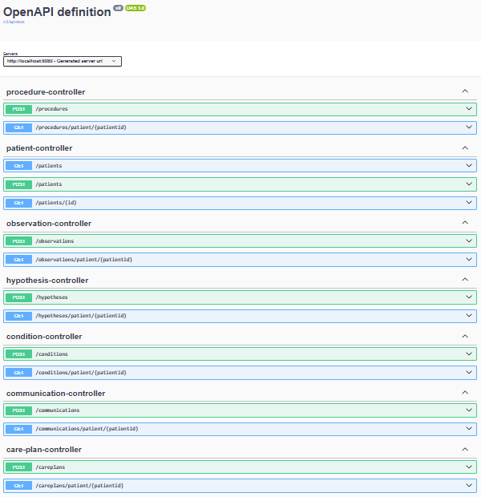
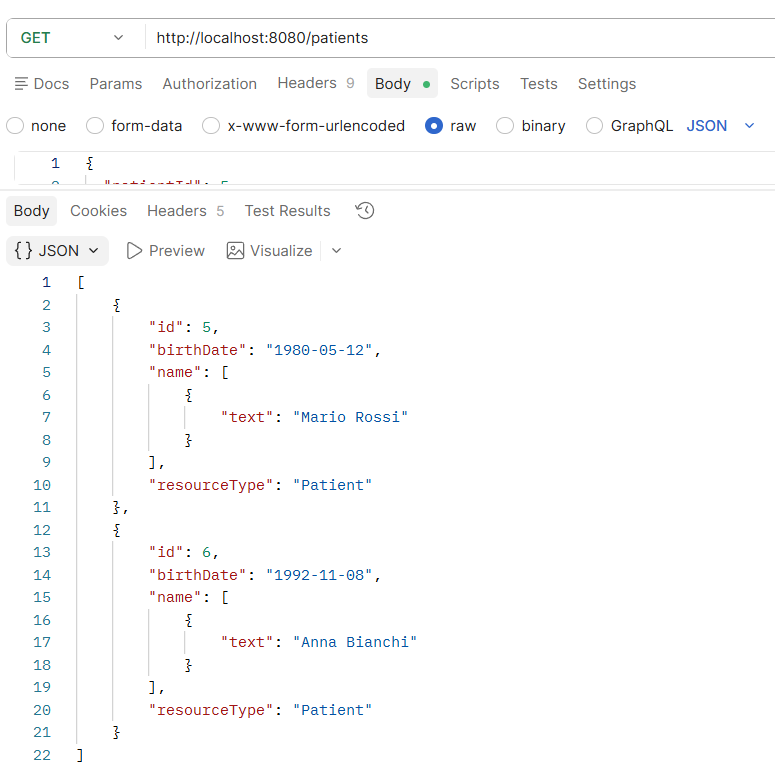
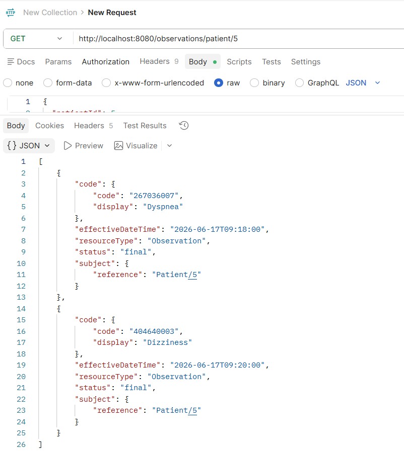
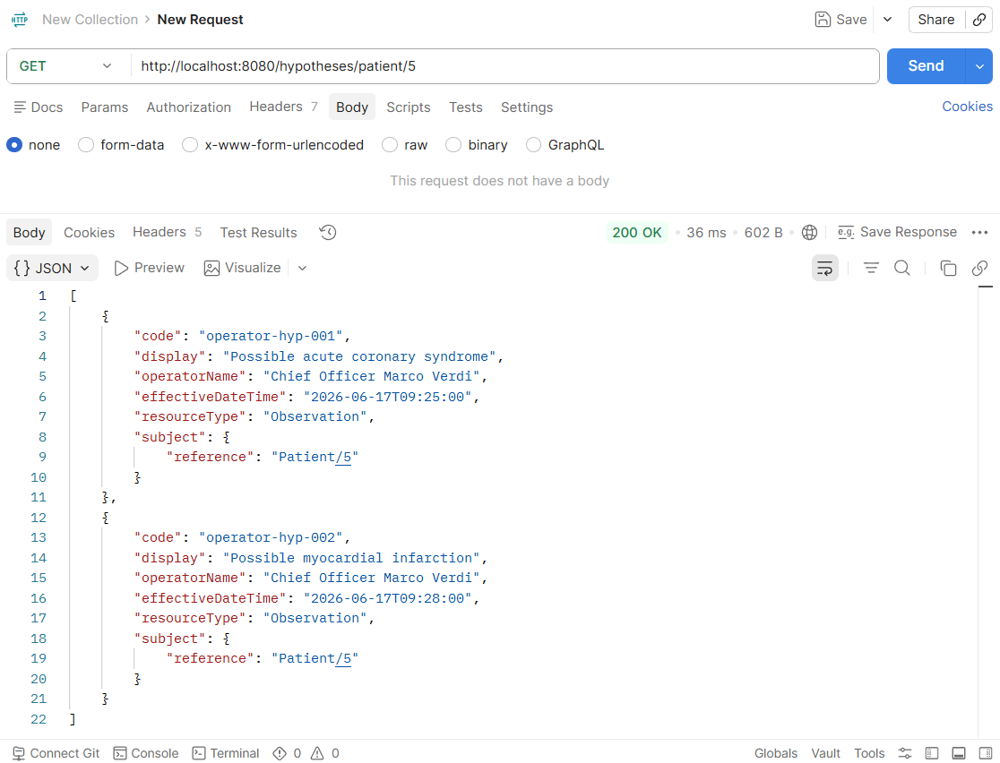
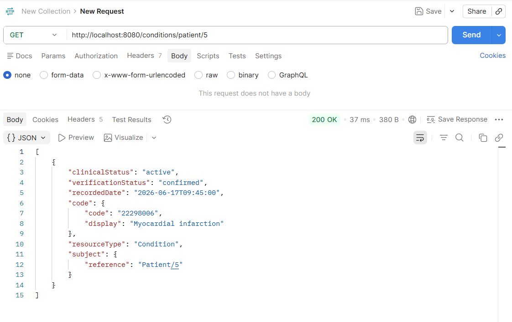
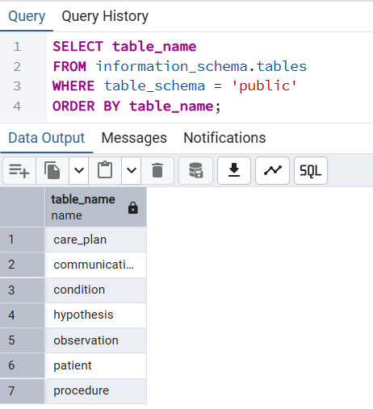
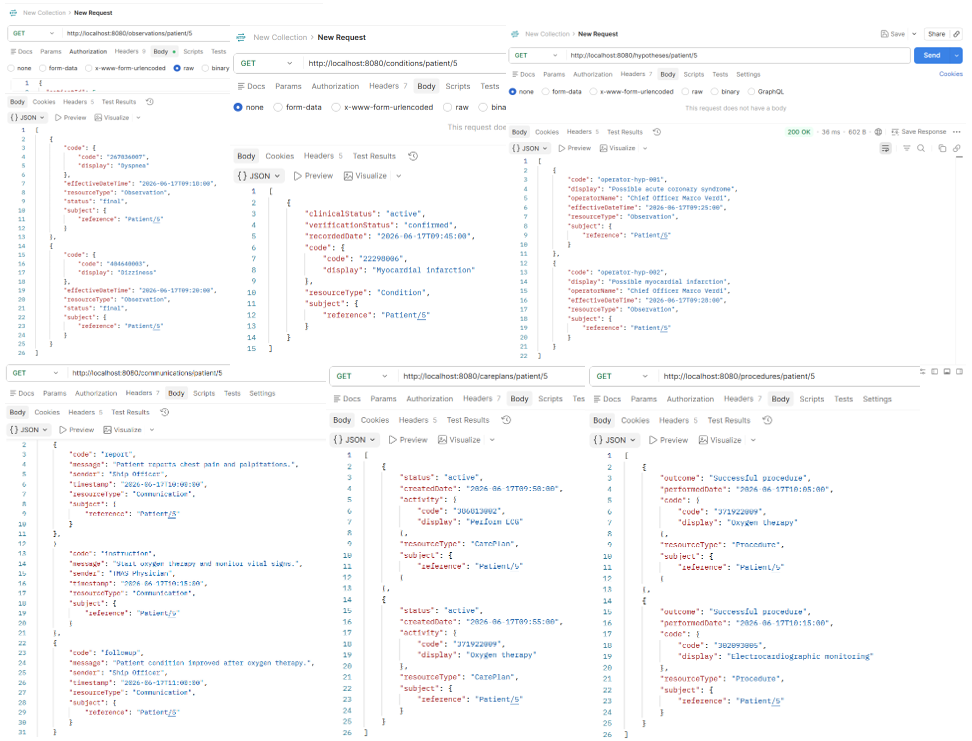

# Marine Emergency FHIR System

Spring Boot REST API for maritime cardiac emergency management using HL7 FHIR-inspired resources and TMAS clinical workflows.

---

## Overview

Marine Emergency FHIR System is a Java Spring Boot application developed as part of a Thesis project focused on maritime telemedicine and cardiac emergency management.

The system models the clinical workflow between onboard personnel and TMAS (Telemedical Maritime Assistance Service) through a set of FHIR-inspired healthcare resources.

The application supports the collection of patient symptoms, preliminary onboard assessments, remote clinical diagnosis, therapeutic recommendations, onboard procedures and medical communications.

---

## Features

### Patient

Management of patient demographic information.

* Create patient
* Retrieve patient by ID
* Retrieve all patients

### Observation

Recording of cardiac symptoms observed onboard.

Examples:

* Chest pain
* Dyspnea
* Palpitations
* Fatigue
* Dizziness

### Hypothesis

Preliminary assessment formulated by onboard personnel before TMAS evaluation.

Examples:

* Suspected myocardial infarction
* Suspected cardiac arrhythmia
* Suspected heart failure

### Condition

Clinical diagnosis issued by TMAS physicians.

Examples:

* Myocardial infarction
* Angina pectoris
* Cardiac arrhythmia
* Heart failure

### CarePlan

Clinical recommendations provided by TMAS.

Examples:

* Administer medication
* Monitor vital signs
* Oxygen therapy
* Perform ECG

### Procedure

Medical procedures performed onboard.

Examples:

* Oxygen therapy
* ECG monitoring
* Administration of medicine
* Cardiopulmonary resuscitation

### Communication

Clinical communication exchanged between onboard personnel and TMAS.

Communication types:

* report
* instruction
* followup

---

## Technology Stack

* Java 24
* Spring Boot
* Spring Data JPA
* Hibernate
* PostgreSQL
* Maven
* Swagger / OpenAPI
* REST API

---

## Architecture

The application follows a layered architecture:

```text
Controller
    ↓
Service
    ↓
Repository
    ↓
PostgreSQL
```

Main packages:

```text
controller
service
repository
model
dto
exception
error
```

---

## Clinical Workflow

The implemented workflow follows the typical management of a cardiac emergency at sea:

```text
Patient
    ↓
Observation
    ↓
Hypothesis
    ↓
Condition
    ↓
CarePlan
    ↓
Procedure
    ↓
Communication
```

---

## API Documentation

Swagger UI:

```text
http://localhost:8080/swagger-ui/index.html
```

OpenAPI specification:

```text
http://localhost:8080/v3/api-docs
```

---

# Screenshots

## Swagger Documentation



Overview of all available REST endpoints generated through OpenAPI.

---

## Patient API



Example response showing registered patients.

---

## Observation API



Example of cardiac symptoms recorded for a patient.

---

## Hypothesis API



Example of preliminary onboard clinical assessment.

---

## Condition API



Example of TMAS-confirmed diagnosis using SNOMED CT terminology.

---

## Database Schema



PostgreSQL database tables used by the application.

---

## Clinical Workflow Example



Example complete workflow from symptom collection to TMAS communication.

---

## Database

The application uses PostgreSQL for persistence.

Main tables:

```text
patient
observation
hypothesis
condition
care_plan
procedure
communication
```

---

## FHIR-Inspired Resources

The project is inspired by HL7 FHIR concepts and includes the following healthcare resources:

| Resource      | Purpose                        |
| ------------- | ------------------------------ |
| Patient       | Demographic information        |
| Observation   | Cardiac symptoms               |
| Hypothesis    | Preliminary onboard assessment |
| Condition     | TMAS diagnosis                 |
| CarePlan      | Clinical recommendations       |
| Procedure     | Onboard medical actions        |
| Communication | TMAS communication             |

---

## Academic Context

This project was developed within a Master's Thesis focused on the application of HL7 FHIR concepts to maritime telemedicine and remote cardiac emergency management.

The goal is to support structured clinical information exchange between ship personnel and TMAS services through interoperable healthcare resources.

---

## Author

Developed as part of a Degree project in Computer Engineering with focus on Healthcare Interoperability, HL7 FHIR and Maritime Telemedicine.
